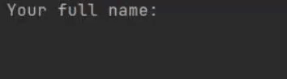
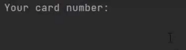
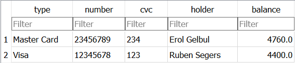
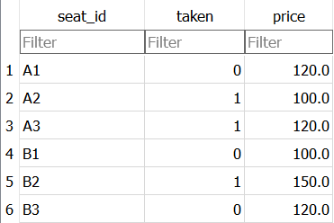
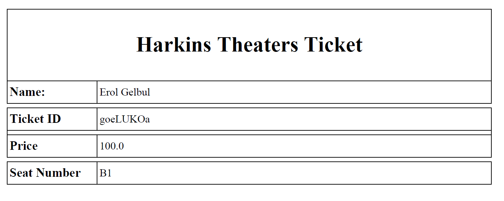

<!-- ABOUT THE PROJECT -->
## About

The project is a movie theater ticket system. The user can select their seat, pay, and receive their ticket in a .pdf file.
The base code of the project is complete. Although, I have not prepared a GUI. I was thinking about setting up a web application
using Django, which could have a bird-eye-view platform that the user can choose to select their seat. The base code could also be
easily integrated with some form of a payment system. So far it only has a CLI.

The user is asked to input 6 values.

* Full Name
* Seat Number
* Card Type

* Card No
* Card CVC
* Card Holder's Name

Note: The reason for asking the user's name on two separate occasions is because of the fact that
, for instance, the user might be using another family member's card. Also, the input values are 
not separated with this logic, I just wanted to showcase them with different GIFS for a better viewing
experience.

  

After the values are recorded, the system checks for errors or missing details. For now, card credentials
of the user is stored in a database called `banking.db`.

  

The seats are stored in `theater.db`. I implemented a live movie scheduling system, although the webscraper
plugin I used for this project was free when I implemented it. I did not want to include that bit but adding
that layer on top of the existing project should be easy.

  

Ultimately, the .pdf file is created.

<!-- TECH -->
## Technologies

Database Engine: [SQLite3](https://www.sqlite.org/index.html)

Libraries: [FPDF](http://www.fpdf.org/)

(<a href="#top">back to top</a>)

<!-- CONTRIBUTING -->
## Contributing

If you would like to add any extra features to the optimisation simulation, feel free to fork and create a pull request. Thank you!

1. Fork the Project
2. Create your Feature Branch (`git checkout -b feature/AmazingFeature`)
3. Commit your Changes (`git commit -m 'Add some AmazingFeature'`)
4. Push to the Branch (`git push origin feature/AmazingFeature`)
5. Open a Pull Request

(<a href="#top">back to top</a>)

<!-- CONTACT -->
## Contact

Erol Gelbul - [Website](http://www.erolgelbul.com) - erolgelbul@gmail.com

Project Link: [Movie Theater](https://github.com/ErolGelbul/movie_theater)

(<a href="#top">back to top</a>)

